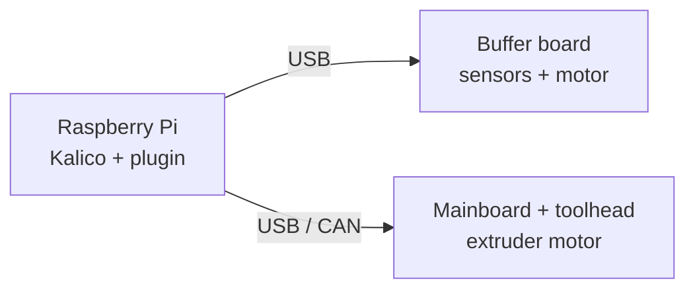
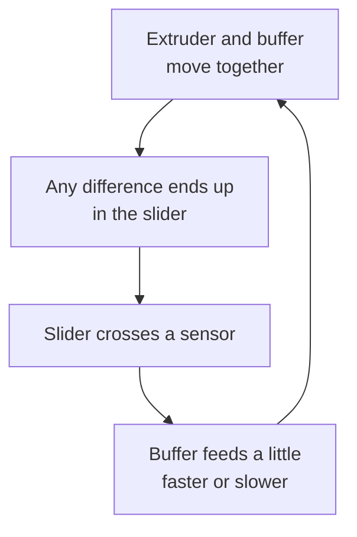
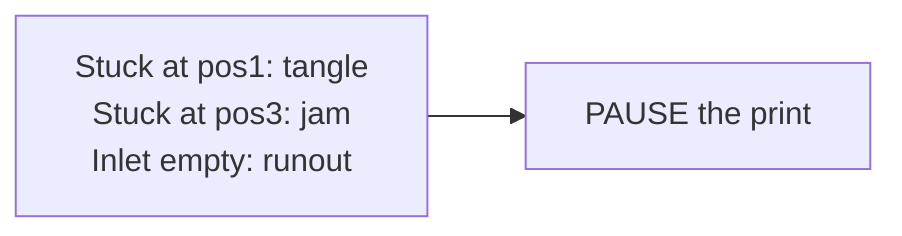
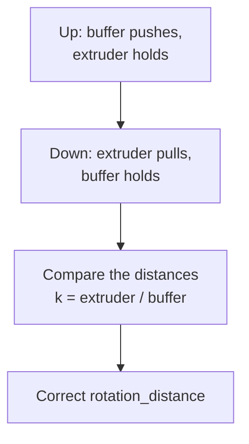
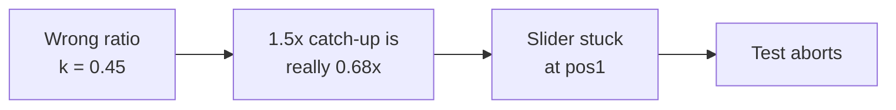

# kalico-filament-buffer

A [Kalico](https://github.com/KalicoCrew/kalico) plugin that turns a three-position filament buffer
(built for the **Mellow Fly LLL Buffer Plus**) into a Kalico-controlled feeder synced to the
extruder. The buffer holds its slider at the middle sensor, so it keeps a steady push on the filament
that **assists the extruder** (less load and less heat at the extruder gears). It pauses the print
only for a real runout, tangle or jam.

**Status:** feed control, fault pausing, loading on insert, calibration and the test tooling are
running on a Voron 2.4, and so are loading to the nozzle and the measured path lengths. Unloading
(synced with the slider relaxed, a free test before the long pull) is new and still owes its first
full run on the printer. A runout deadline and same-spool continuation are next; see
[docs/DESIGN.md](docs/DESIGN.md#planned).

## Hard rules

1. **The buffer never interrupts printing.** While printing, its only action is changing the buffer
   motor's rotation distance (`stepper.set_rotation_distance()`, no toolhead flush: the technique
   Kalico's built-in Belay module uses). Anything that would stop the toolhead (sync, unsync,
   loading, independent moves) is refused in code while a print runs, and a test proves it
   (`tests/test_adapter.py`).
2. **The only exception is a detected fault: a PAUSE, never a cancel.** Faults are a tangle (still at
   pos1), a jam (still at pos3), an impossible sensor state, or an inlet runout. Distances are measured
   in real extruded millimeters, so slow moves and travels can't cause false faults.
3. **Buttons and loading work only when not printing.**
4. **The buffer is a critical MCU.** If it disconnects, Klipper shuts down instead of printing for
   hours with an unfed filament path.

## How it works

**What talks to what.** The Pi runs Kalico and this plugin. The buffer board is its own Kalico
MCU on USB: it reads the slider sensors and drives the buffer motor.



**The filament path.** The slider between the buffer and the extruder stores slack. Its spring
pushes the filament toward the extruder, which is what assists it.


**The loop during a print.** Both motors follow the same G-code moves. Only the buffer's step
size is adjusted, so the print never slows or stops for it.



**When it pauses.** Only for a real fault, and it pauses rather than cancels.



The buffer motor is an `[extruder_stepper]` synced to the extruder. Hall sensors along the slider's
travel give the zone, and the plugin feeds slightly more or less than the extruder:

| Zone | Multiplier | |
|---|---|---|
| pos1 (spring relaxed) | 1.50 | catch up |
| below pos2: approaching / hovering | 1.15 / 1.02 | |
| **pos2 (target)** | **0.99** | drift down very slowly: the slider hovers at the bottom edge of pos2 |
| pos2, coming down from pos3 | 0.85 | relieve until the bottom edge of pos2 |
| pos3 (over-pushed) | 0.30 | relieve, and push little into a possible jam |

On the LLL Plus, pos2 stays blocked from its lower edge up through pos3 (`sensor_layout: overlap`).
Buffers with three separate sensor windows use `sensor_layout: separate`, which adds hover and
approach rates above pos2 (0.98 / 0.85).

An auto-trim learns each filament's true feed ratio, so the feedback ends up only compensating the
filament's own tolerance. Retractions (up to 1 mm and more) are followed exactly: when hovering, a
1 mm retraction moves the slider less than 0.05 mm. Full design and reasoning:
[docs/DESIGN.md](docs/DESIGN.md).

### The control law in brief

The slider stores slack, so its position $x$ follows the difference between what the buffer
delivers and what the extruder takes. With $E$ the extruder position, $m$ the zone multiplier,
$\tau$ the learned trim and $r$ the buffer's remaining feed error:

```math
\frac{dx}{dE} = g\,m(z) - 1, \qquad g = (1+r)\,\tau
```

Everything is per mm of extrusion rather than per second, so pauses and slow moves don't matter.
Around the lower edge of pos2 the multiplier switches between $1-\varepsilon$ (inside) and
$1+\delta$ (below), which holds the slider at the edge whenever

```math
\frac{1}{1+\delta} < g < \frac{1}{1-\varepsilon}, \qquad \delta = 0.02,\ \varepsilon = 0.01
```

The trim is learned so $g$ stays in that band. From a hover cycle, using the share $f_2$ of
extrusion spent inside pos2, the remaining error is $\hat e = f_2(\delta+\varepsilon) - \delta$. From
a rise through the pos2 band of width $w$ over $\Delta E$ of extrusion, it is set in one step to
$\tau' = \tau\\,(1-\varepsilon)/(1 + w/\Delta E)$. Calibration measures the buffer's true feed per
commanded mm as $k = S_e / S_b$, the extruder span over the buffer span between the same sensor
edges.

The derivations, assumptions and where every default comes from are in
[docs/CONTROL.md](docs/CONTROL.md).

## Loading and calibration

- **Loading:** insert filament at the buffer inlet (filament already there when Klipper starts
  doesn't count as an insert). After a second the buffer feeds it, slowly for
  the first 20 mm so the gear catches it, then at 30 mm/s, until the slider reaches pos2. That
  means the tip is pressed against the extruder gears. pos2 and pos3 double as endstops on the
  buffer MCU, so the motor stops the moment a sensor trips. Press either buffer button to cancel.
  `BUFFER_LOAD` does the same on demand, and `BUFFER_LOAD TO=nozzle TEMP=` carries on through
  the hotend and purges. A load from an empty path measures the path on the way.
- **Unloading:** `BUFFER_UNLOAD TEMP=` relaxes the slider, retracts with the buffer following a
  hair faster than the extruder so nothing presses the soft tip into the gears, checks the tip is
  really free, then pulls it back to the buffer and measures the gears-to-nozzle length on the way.
  `EJECT=1` pulls it out past the buffer gear.
  The whole sequence is in [docs/DESIGN.md](docs/DESIGN.md#loading-buttons-and-calibration).
- **Buttons:** hold FEED or RETRACT to move the buffer for as long as you hold it. FEED stops by
  itself at pos3, so it can't push the tube out of its fitting.
- **Calibration:** with filament loaded through the extruder and the hotend hot, `BUFFER_CALIBRATE`
  measures the buffer's true `rotation_distance` against the extruder (a warm-up cycle and three
  runs, about 15 mm extruded each) and applies it until the next restart. It prints the value to put in the config,
  along with the slider's sensor geometry.

### Calibration, step by step

With filament through the extruder and the hotend hot, `BUFFER_CALIBRATE` moves the slider up
with one motor and back down with the other, and compares the two distances:



It runs a warm-up cycle first, then three measured runs that must agree within 4%.

### Why calibration matters

The slider covers the same distance both ways, so $k$ is how much filament the buffer really
moves per mm it is told to move. Holding the slider at pos2 needs the buffer within about
$-2\\%$ to $+1\\%$ of the extruder, and the auto-trim can only make up $\pm 5\\%$. A wrong
`rotation_distance` is outside what the control loop can fix:



For example, a `rotation_distance` derived from the stock firmware's settings gives $k \approx 0.45$
on the LLL Plus, and `BUFFER_TEST_EXTRUDE` aborts at pos1. A calibrated buffer measures within a
few percent of $k = 1$.

## Requirements

- **Kalico** (uses `klippy/plugins/`; tested on v2026.10.00-58). Mainline Klipper has no plugin directory.
- The buffer running Kalico firmware as its own MCU:
  [docs/mellow-buffer-plus.md](docs/mellow-buffer-plus.md) (backup, Katapult, Kalico, pin map).
- Buffer powered from the printer's 12–24 V supply; USB for data only.

## Install

```bash
cd ~ && git clone https://github.com/SettlingAbyss96/kalico-filament-buffer.git
~/kalico-filament-buffer/install.sh --with-tests
```
Copy [config/mellow-buffer-plus.cfg](config/mellow-buffer-plus.cfg) into your config (set the
buffer's serial), `[include]` it plus `buffer-test.cfg`, and restart Klipper.

> **After updating the plugin code, restart the Klipper service** (`sudo systemctl restart klipper`).
> `RESTART` and `FIRMWARE_RESTART` reload the config inside the same Python process, which keeps
> the previously imported plugin module, so new code would not load. Config-only changes just need
> `RESTART`.

Updates through Moonraker (add to `moonraker.conf`):
```ini
[update_manager kalico-filament-buffer]
type: git_repo
path: ~/kalico-filament-buffer
origin: https://github.com/SettlingAbyss96/kalico-filament-buffer.git
primary_branch: main
managed_services: klipper
```

## Commands

| Command | |
|---|---|
| `BUFFER_STATUS` | zone, multiplier, trim, sensors, rotation distance, fault |
| `BUFFER_STATS [RESET=1]` | extrusion share per zone, zone entries, rate changes, trim learning since reset |
| `BUFFER_SYNC` / `BUFFER_UNSYNC` | sync the buffer to the extruder / release it. during a print both need the toolhead stopped: SYNC after an M400 in PRINT_START, UNSYNC after an M400 in PRINT_END |
| `BUFFER_LOAD [SPEED=] [MAX=] [TO=nozzle] [PURGE=30] [TEMP=]` | feed from the inlet until the slider reaches pos2 (also runs by itself when filament is inserted). `TO=nozzle` continues through the hotend and purges; park the nozzle over a purge spot first |
| `BUFFER_UNLOAD [TEMP=] [EJECT=1] [PARK=50] [MAX=] [PATH=]` | retract out of the hotend and extruder with the slider relaxed, test that the tip is free, pull it back to the buffer (or past the gear with `EJECT=1`). Stops with a clear message if the tip is stuck |
| `BUFFER_CALIBRATE [RUNS=3] [TEMP=]` | measure and apply the buffer's true `rotation_distance` |
| `BUFFER_MOVE DIST= [SPEED=]` | move the buffer on its own; feeding stops early at pos3 |
| `BUFFER_SET ...` | runtime tuning (multipliers, fault distances, trim, `BAND_MM`, `REPORT_EVENTS=0/1`, `ROTATION_DISTANCE`) |
| `BUFFER_TEST_EXTRUDE [TEMP=] [LENGTH=300] [SPEEDS=1.5,3,5] [RETRACT=1.0] [DRY_RUN=1] [CHECK_Z=0] ...` | automated synced-extrusion test: syncs, extrudes in segments with retractions, checks the buffer every 25 mm (aborts safely on anomalies), reports PASS/CHECK with statistics. `CHECK_Z=0` skips the homing check when you know the nozzle is clear of the bed |
| `BUFFER_TEST_SLACK [CYCLES=5] [SPEED=3]` | with the extruder holding the filament, drives the slider pos1 to pos3 and back and reports where each sensor trips each way: the dead band in the path (filament snaking in the tube, friction, backlash) and the spans |
| `BUFFER_TEST_SPEED [SPEEDS=30,45,60,80,100] [DIST=80] [CYCLES=2]` | how fast the buffer feeds without skipping: from contact at the gears, round trips out `DIST` and back at each speed, stopping at the first that comes back off. Checks the tip is free first. May go past `max_move_speed`, up to 150 mm/s |

While printing, only `BUFFER_STATUS`, `BUFFER_STATS`, `BUFFER_SET` tuning, and `BUFFER_SYNC` /
`BUFFER_UNSYNC` with the toolhead stopped (in `PRINT_START` and `PRINT_END`) are accepted.

`printer.filament_buffer` status: `synced`, `zone`, `multiplier`, `trim`, `applied_multiplier`,
`fault`, `faults_armed`, `base_rotation_distance`, `loading`, `unloading`, `last_load_mm`,
`path_mm`, `nozzle_mm` (0 until measured), and each input
(`pos1`, `pos2`, `pos3`, `inlet`, `key_feed`, `key_retract`).

## Configuration: `[filament_buffer]`

| Option | Default | |
|---|---|---|
| `extruder_stepper` | `buffer` | name of the `[extruder_stepper]` driving the buffer |
| `extruder` | `extruder` | extruder to sync to |
| `pos1_pin`, `pos2_pin`, `pos3_pin` | required | slider sensors, true = blocked |
| `inlet_pin` | required | inlet switch, true = filament present |
| `feed_button_pin`, `retract_button_pin` | none | optional buttons |
| `ok_led`, `fault_led` | none | `[output_pin]` names |
| `report_events` | True | print every sensor/button change |
| `sensor_layout` | `overlap` | `overlap` (pos2 stays blocked through pos3, as on the LLL Plus) or `separate` |
| `band_mm` | 4.4 | filament mm from the lower edge of pos2 to pos3 (`BUFFER_CALIBRATE` measures it) |
| `autoload` | True | load to pos2 when filament is inserted into an empty buffer |
| `autoload_delay` | 1 s | wait after the inlet switch closes |
| `load_speed`, `load_max_mm` | 30 mm/s, 1500 mm | loading speed and the longest path it will feed |
| `load_fast_speed`, `load_approach_mm` | 80 mm/s, 150 mm | with the path and the tip's position known, a load covers the way at `load_fast_speed` and only the last `load_approach_mm` at `load_speed` |
| `load_grab_mm`, `load_grab_speed` | 20 mm, 10 mm/s | slow start so the gear catches the filament |
| `button_speed` | 20 mm/s | hold-to-move speed |
| `max_move_speed`, `move_accel` | 120 mm/s, 500 mm/s² | independent moves (the LLL Plus ran clean to 150 mm/s at 0.3 A) |
| `m_pos1`, `m_approach_below`, `m_below`, `m_target`, `m_above`, `m_approach_above`, `m_pos3` | 1.50, 1.15, 1.02, 0.99, 0.98, 0.85, 0.30 | zone multipliers |
| `tension_fault_mm`, `compression_fault_mm` | 60, 25 | extruded mm stuck at pos1 / pos3 before PAUSE |
| `trim_limit`, `trim_gain`, `trim_nudge` | 0.05, 0.5, 0.01 | auto-trim bounds, learning gain, nudge size |
| `hover_stall_mm`, `debounce_mm`, `up_stay_flip_mm` | 60, 0.3, 300 | control-law internals (see [DESIGN.md](docs/DESIGN.md#feed-control)) |
| `idle_motor_off` | True | switch the buffer motor off whenever it is idle and unsynced |
| `pos1_slack_mm`, `pos2_slack_mm` | 19, 28.6 | slack the slider holds at the top of pos1 and the lower edge of pos2 (LLL Plus) |
| `path_mm`, `nozzle_mm` | measured | inlet to extruder gears, gears to nozzle. Measured by autoload and `BUFFER_UNLOAD` and kept with `SAVE_VARIABLE` when `[save_variables]` exists; set them here to override |
| `unload_fast_mm`, `unload_fast_speed`, `unload_speed`, `unload_ram_mm` | 25, 35 mm/s, 20 mm/s, 3 | the unload retraction: fast out of the hot zone, then steady, after a small push |
| `unload_test_mm`, `unload_overrun_mm` | 22, 45 | the free test feed, and how far the extruder retracts past the gears-to-nozzle length ([CONTROL.md, section 11](docs/CONTROL.md#11-unloading-running-it-backwards)) |
| `park_mm`, `eject_margin_mm` | 50, 60 | where an unload leaves the tip, and how far past the path an eject pulls |

Defaults are the values the offline simulation suite validates. A test checks that the config defaults
can't drift from them.

## Testing

- **Offline** (no printer): `python3 -m unittest discover -s tests -v`. There are 71 tests:
  - A physical model of the slider, with the sensor geometry measured on a real LLL Plus, drives
    the real controller: retractions up to 1 mm, flow up to 15 mm/s, ratio errors ±4%, sensor
    noise, slow rate application, other sensor geometries and layouts, mid-print filament changes,
    a slipping gear, a clog, and long soak runs.
  - The same model runs long synced retractions: the forward multipliers pull against the
    extruder, holding pos2 leaves the spring pressing on the tip as it leaves the gears, and a
    relaxed follow never pushes.
  - Adapter tests check the hard rule, loading, unloading, the motor switching off, the measured
    lengths, buttons and calibration math against stand-in Kalico objects.
- **Hardware:** `config/buffer-test.cfg` (`BUFFER_TEST_HELP` lists the steps), ending with
  `BUFFER_TEST_EXTRUDE`.

## Design decisions

The choices that shape everything else, with the reasoning behind each. The math is in
[docs/CONTROL.md](docs/CONTROL.md).

**Why is the control coordinate extrusion distance and not time?**

The slider only moves when filament moves. What the buffer has to track is filament consumption,
not elapsed seconds. So every rate, learning window and fault threshold is expressed per mm of
extrusion:

```math
\frac{dx}{dE} = g\,m - 1
```

Time doesn't appear, which makes the controller insensitive to print speed, travel moves, pauses
and dwells. A slow first layer and a fast infill section look the same to it, and a long travel
can never be mistaken for a jam ([CONTROL.md, section 2](docs/CONTROL.md#2-plant-model)).

**Why treat the buffer's spring and slack as part of the controller?**

Because the buffer is a physical integrator. Its position is the running total of the mismatch
between what the buffer feeds and what the extruder takes:

```math
x(E) = x_0 + \int (g\,m - 1)\,dE
```

Instead of treating the slack as an inconvenience to minimize, the design reads it as stored
state. The mechanism itself integrates the feed error, and the Hall sensors sample that integral.
That is what makes it possible to learn the ratio error from how long the slider spends on each
side of the pos2 edge ([CONTROL.md, section 5](docs/CONTROL.md#5-learning-the-trim)).

**Why calibrate against the extruder instead of an absolute measurement?**

Neither the buffer's nor the extruder's `rotation_distance` has to represent a perfect physical
millimeter. Calibration finds the transformation that makes the buffer agree with the toolhead:

```math
k = \frac{S_e}{S_b}, \qquad \mathrm{rd}_{new} = k \cdot \mathrm{rd}_{old}
```

where $S_e$ is in the extruder's commanded mm. If the extruder itself is 2% off, $S_e$ carries
the same 2%, and the buffer ends up matching what the extruder really does. No ruler, no marked
filament, and no dependence on how well the extruder was calibrated
([CONTROL.md, section 9](docs/CONTROL.md#9-calibration)).

**Why is there only one definition of "a millimeter of filament"?**

The toolhead's extrusion coordinate is the reference for everything. The slicer, the motion
planner and the extruder already agree on it. The buffer adapts to it (calibration, trim and
multipliers all scale the buffer relative to $E$) rather than introducing a second, competing
definition that the two motors would then disagree about.

**What accuracy does the buffer actually need?**

Relative flow accuracy, not absolute accuracy. To hold the slider at pos2 the buffer must deliver
the same filament rate as the extruder within a narrow band:

```math
\frac{1}{1+\delta} < g < \frac{1}{1-\varepsilon} \qquad (\text{about } -2\% \text{ to } +1\%)
```

It never needs to know how many millimeters of filament really moved. The design solves this
weaker, correct requirement rather than the harder problem of absolute filament metering, which
the subsystem doesn't need.

**How are feedforward and feedback split?**

Feedforward does the bulk of the work: the buffer is synced to the extruder's motion, so it
follows every extrusion, retraction and speed change exactly as they are planned, with no delay
and no sensing involved. Feedback only handles what is left: the slider sensors adjust a
multiplier within a few percent of 1, and the trim learns the slowly varying ratio error.

```math
\text{buffer feed} = \underbrace{\mathrm{d}E}_{\text{feedforward}} \times \underbrace{\tau\,m(z)}_{\text{feedback, near } 1}
```

Because the feedback only corrects a residual of a few percent, it can stay gentle. The control
signal is a small multiplier applied to a motion that is already right, so the printer's motion
is never interrupted by it.

**Why does unloading keep the slider relaxed?**

Because the tip comes out of the gears soft, and a compressed slider presses it straight back in.
The zone control would hold the slider at pos2 (and run the wrong way backwards anyway, since slack
changes by $`(g\,m - 1)\,dE`$ whichever way the extruder turns). On the printer that mashed the tip
into a blob the tube wouldn't take, four times in a row. So the slack comes out first and the buffer
just follows a hair faster than the extruder: it never pushes, and the moment the tip is free it
pulls it away ([CONTROL.md, section 11](docs/CONTROL.md#11-unloading-running-it-backwards)).

**Why prove the tip is free before pulling it back?**

Because at rest the slider reads the same whether the filament is free or held fast: either way
nothing compresses it. A long pull against a stuck tip just grinds the filament at the buffer gear.
Feeding a little forward tells them apart (a held tip compresses the slider, a free one slides), so
the long pull only ever runs on filament that can move.

**Why switch the motor off when idle?**

It doesn't need holding torque between moves, and holding costs heat. Held at 0.49 A with nothing
moving, the motor got past 60 °C in the closed buffer box, and the board's sensor climbed about
10 °C over its idle reading. The stock firmware switched it off after every move as well.

## Credits

The no-flush rate-change technique comes from [Belay](https://github.com/Annex-Engineering/Belay)
(Annex Engineering), which is built into Kalico. Happy Hare and AFC use the same approach. The stock
buffer firmware is from [FLY3DTeam/Buffer](https://github.com/FLY3DTeam/Buffer).

## License

GPLv3, like Kalico. See [LICENSE](LICENSE).
